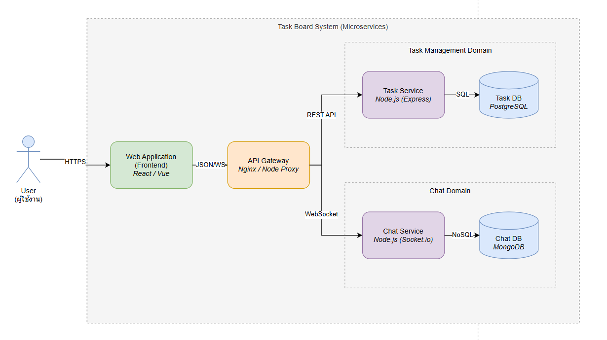

## Week 4: Microservices Design


## 1. Architecture Design


### สิ่งที่ต้องตอบในส่วนนี้:
---
### 1. **Database Choice:** ทำไม Chat ถึงควรใช้ NoSQL (MongoDB) มากกว่า SQL? (Hint: Structure ของ Chat Log, Write Speed)
* ใช้การสื่อสารแบบ Asynchronous Messaging ผ่าน Message Broker (เช่น RabbitMQ หรือ Redis Pub/Sub) ครับ โดยเมื่อ Task Service สร้างงานเสร็จ จะ Publish Event ชื่อ TaskCreated ออกไป จากนั้น Chat Service ที่ Subscribe Event นี้อยู่จะรับข้อมูลไปแจ้งเตือน User ในห้องแชททันที วิธีนี้ช่วยให้ระบบทั้งสองไม่ผูกติดกัน (Decoupling) หาก Chat Service ล่ม ระบบ Task ก็ยังทำงานต่อได้


---

### 2. **Communication:** Task Service จะคุยกับ Chat Service อย่างไร? (เช่น เมื่อมี Task ใหม่ ให้แจ้งเตือนใน Chat)
* เราเลือกใช้ MongoDB เพราะระบบ Chat มีการเขียนข้อมูลที่รวดเร็วและปริมาณมาก (High Write Speed) ซึ่ง NoSQL รองรับได้ดีกว่า และโครงสร้างข้อมูลของแชทมีความหลากหลาย (Unstructured Data) เช่น ข้อความ, รูป, สติ๊กเกอร์ การใช้ MongoDB ที่เก็บแบบ JSON จึงยืดหยุ่นในการพัฒนาฟีเจอร์ใหม่ๆ มากกว่า SQL ที่มีโครงสร้างตารางตายตัว

---
## 2. Event & API Design


### Event Flow (WebSocket) - สำหรับ Chat Service**สถานการณ์:** User A และ User B กำลังดู Task ตัวเดียวกันอยู่ (เช่น Task ID: 101) และ User A พิมพ์ข้อความว่า "งานนี้ด่วนไหมครับ?"


#### Flow การทำงาน:1. **Connection:** User เข้าหน้า Task 101 -> Client ส่ง Event ขอเข้าห้องแชท (`join_room`)
2. **Messaging:** User A พิมพ์ข้อความ -> Client ส่ง Event ส่งข้อความ (`send_message`)
3. **Broadcasting:** Server รับข้อความ -> ส่งต่อให้ทุกคนในห้อง (`receive_message`)

#### รายละเอียด Events (Payload):
**A. Client Emits: `join_room` (ขอเข้าห้องแชท)**
เมื่อ User เปิดหน้า Task ID 101

```json
// ส่งไปหา Server
{
  "event": "join_room",
  "data": {
    "roomId": "task_101",
    "userId": "user_A"
  }
}

```

**B. Client Emits: `send_message` (ส่งข้อความ)**
เมื่อ User A กด Enter ส่งข้อความ

```json
// ส่งไปหา Server
{
  "event": "send_message",
  "data": {
    "roomId": "task_101",
    "senderId": "user_A",
    "message": "งานนี้ด่วนไหมครับ?",
    "type": "text",  // หรือ 'image', 'sticker'
    "timestamp": "2025-12-03T10:00:00Z"
  }
}

```

**C. Server Broadcasts: `receive_message` (กระจายข้อความ)**
Server ส่งข้อมูลกลับมาให้ User B (และคนอื่นๆ ในห้อง `task_101`) เพื่อนำไป Render ขึ้นหน้าจอ

```json
// Server ส่งหา Client ทุกคนในห้อง
{
  "event": "receive_message",
  "data": {
    "messageId": "msg_999",
    "senderName": "Panuwat", // Server อาจจะไป Join ชื่อมาให้แล้ว
    "message": "งานนี้ด่วนไหมครับ?",
    "timestamp": "2025-12-03T10:00:00Z"
  }
}

```

---

### REST API Design - สำหรับ Task Service**สถานการณ์:** การจัดการข้อมูลงาน (CRUD) จะใช้ HTTP Methods มาตรฐาน ไม่จำเป็นต้อง Real-time ขนาด WebSocket

#### Endpoint 1: สร้าง Task ใหม่ (Create)* **Method:** `POST`
* **URL:** `/api/v1/tasks`
* **Request Body:**
```json
{
  "title": "ออกแบบหน้า Dashboard",
  "description": "ใช้โทนสีม่วงตาม Theme",
  "priority": "High",
  "assigneeId": "user_B"
}

```


* **Response (201 Created):**
```json
{
  "taskId": 102,
  "status": "success",
  "message": "Task created successfully"
}

```


* (Note: จุดนี้แหละที่ Backend อาจจะแอบยิง Event ไปบอก Chat Service ว่ามีงานใหม่)*

#### Endpoint 2: ดึงรายการ Task ทั้งหมด (Read)* **Method:** `GET`
* **URL:** `/api/v1/tasks?status=todo` (รองรับ Query Params เพื่อ Filter)
* **Response (200 OK):**
```json
{
  "data": [
    {
      "id": 101,
      "title": "Setup Environment",
      "status": "todo",
      "priority": "High"
    },
    {
      "id": 102,
      "title": "ออกแบบหน้า Dashboard",
      "status": "todo",
      "priority": "High"
    }
  ]
}

```


#### Endpoint 3: อัปเดตสถานะงาน (Update)* **Method:** `PATCH` (ใช้ PATCH เพราะแก้แค่บางฟิลด์)
* **URL:** `/api/v1/tasks/101`
* **Request Body:**
```json
{
  "status": "done"
}

```


* **Response (200 OK):**
```json
{
  "id": 101,
  "updatedAt": "2025-12-03T12:00:00Z"
}

```

---

## 3. Challenges & Solutions

### 1. Challenge: Data Consistency (ความถูกต้องของข้อมูลข้าม Service)**ปัญหา:** ใน Monolith เราสามารถใช้ SQL `JOIN` ตาราง Users กับ Tasks หรือ Chat ได้เลย แต่พอแยก Database (Database per Service) เราไม่สามารถ Join ข้ามเครื่องได้

* *ตัวอย่าง:* ถ้า User เปลี่ยนชื่อ หรือถูกลบออกจากระบบหลัก (`User Service` หรือ `Task Service`) ข้อมูลชื่อใน `Chat Service` อาจจะไม่อัปเดตตามทันที

**Solution (ทางออก):**

* **Eventual Consistency:** ยอมรับว่าข้อมูลอาจจะไม่ตรงกันทันที 100% (Real-time) แต่จะตรงกันในที่สุด
* **Data Replication via Events:** เมื่อมีการแก้ข้อมูล User ให้ Publish Event (`UserUpdated`) ออกมา แล้วให้ Chat Service รับ Event นั้นไปอัปเดตข้อมูลใน Database ของตัวเอง (เก็บข้อมูล User บางส่วนไว้ที่ฝั่ง Chat ด้วย เพื่อลดการยิง Request ข้ามไปมา)

---

### 2. Challenge: Network Latency & Failure (ความล่าช้าและการล่มของระบบ)**ปัญหา:** การเรียกหากันผ่าน Network (HTTP/TCP) ช้ากว่าการเรียกฟังก์ชันใน Memory เดียวกัน และมีความเสี่ยงที่ "Service ปลายทางจะล่ม"

* *ตัวอย่าง:* ถ้า `Task Service` ยิง REST API ไปบอก `Chat Service` ให้แจ้งเตือน แต่ `Chat Service` ล่มอยู่ -> `Task Service` อาจจะค้าง (Timeout) หรือ Error ตามไปด้วย (Cascading Failure)

**Solution (ทางออก):**

* **Asynchronous Messaging:** ใช้ Message Broker (RabbitMQ/Kafka) อย่างที่คุยกันไปครับ ถ้า Chat ล่ม ข้อความจะรออยู่ในคิว ไม่หายไปไหน และ Task Service ก็ทำงานต่อได้เลย
* **Circuit Breaker Pattern:** ถ้า Service ปลายทาง Error บ่อยๆ ให้ระบบ "ตัดวงจร" (หยุดเรียกชั่วคราว) แล้วคืนค่า Default หรือ Error ทันทีโดยไม่ต้องรอ Timeout เพื่อประหยัดทรัพยากร

---

### 3. Challenge: Testing & Debugging (การทดสอบและหาบั๊ก)**ปัญหา:** การหาบั๊กยากขึ้นมาก เพราะ Request หนึ่งครั้งอาจวิ่งผ่านหลาย Service

* *ตัวอย่าง:* กดสร้าง Task แล้วไม่แจ้งเตือน... มันพังที่ Frontend? พังที่ Gateway? พังที่ Task Service? หรือพังที่ Chat Service? ต้องไล่ดู Log ทีละตัว

**Solution (ทางออก):**

* **Centralized Logging:** ส่ง Log ของทุก Service ไปเก็บที่เดียวกัน (เช่น ELK Stack หรือง่ายๆ คือดูผ่าน Docker Dashboard)
* **Correlation ID:** แปะ ID (เช่น `req-12345`) ไปกับทุก Request Header ที่ส่งข้าม Service เพื่อให้ Search หาใน Log ได้ว่า ID นี้วิ่งผ่าน Service ไหนบ้างแล้วเกิด Error ที่จุดไหน

---

### 4. Challenge: Complexity in Development (ความยุ่งยากในการรันโปรเจกต์)**ปัญหา:** จากเดิมรัน `npm start` คำสั่งเดียวจบ ตอนนี้ต้องรัน Database 2 ตัว, API Gateway, Task Service, Chat Service, Message Broker... ต้องเปิด Terminal 6-7 จอ

**Solution (ทางออก):**

* **Containerization (Docker):** ห่อทุก Service เป็น Docker Container
* **Docker Compose:** เขียนไฟล์ `docker-compose.yml` ไฟล์เดียว เพื่อสั่ง `docker-compose up` แล้วรันทุกอย่าง (Database + App + Network) ขึ้นมาพร้อมกันในสภาพแวดล้อมจำลองที่เหมือนกันทั้งทีม

---

### สรุปตารางเปรียบเทียบ (สำหรับ Presentation)
| Challenge (ความท้าทาย) | Solution (ทางแก้ไข) |
| --- | --- |
| **No SQL Joins** (Join ข้าม DB ไม่ได้) | ใช้การอ้างอิง ID และส่งข้อมูลอัปเดตผ่าน Events |
| **Service Downtime** (Service ล่มแล้วพากันพัง) | ใช้ Asynchronous Messaging (Message Broker) เพื่อลดการผูกมัด |
| **Debugging** (หาบั๊กยาก) | ใช้ Correlation ID และรวม Log ไว้ที่เดียว |
| **Environment Setup** (รันยาก) | ใช้ Docker Compose เพื่อจำลองระบบทั้งหมด |