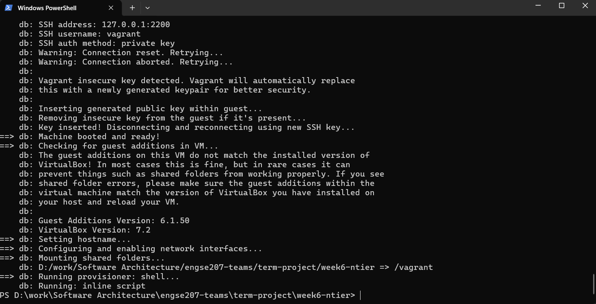
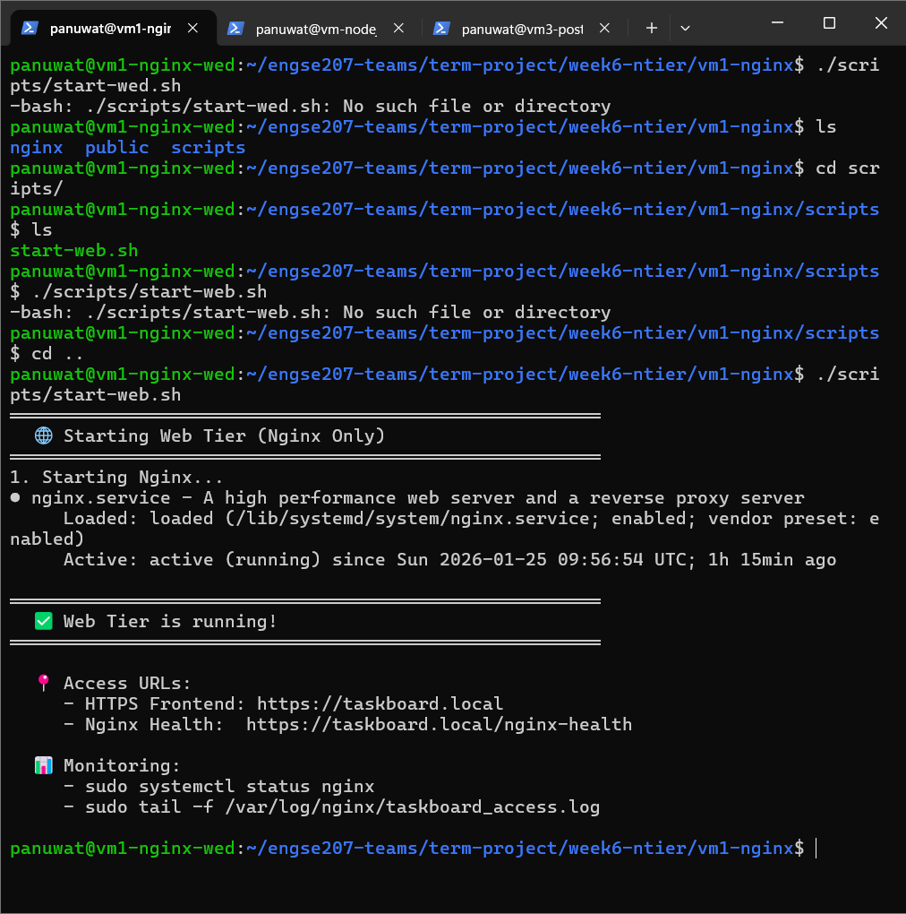
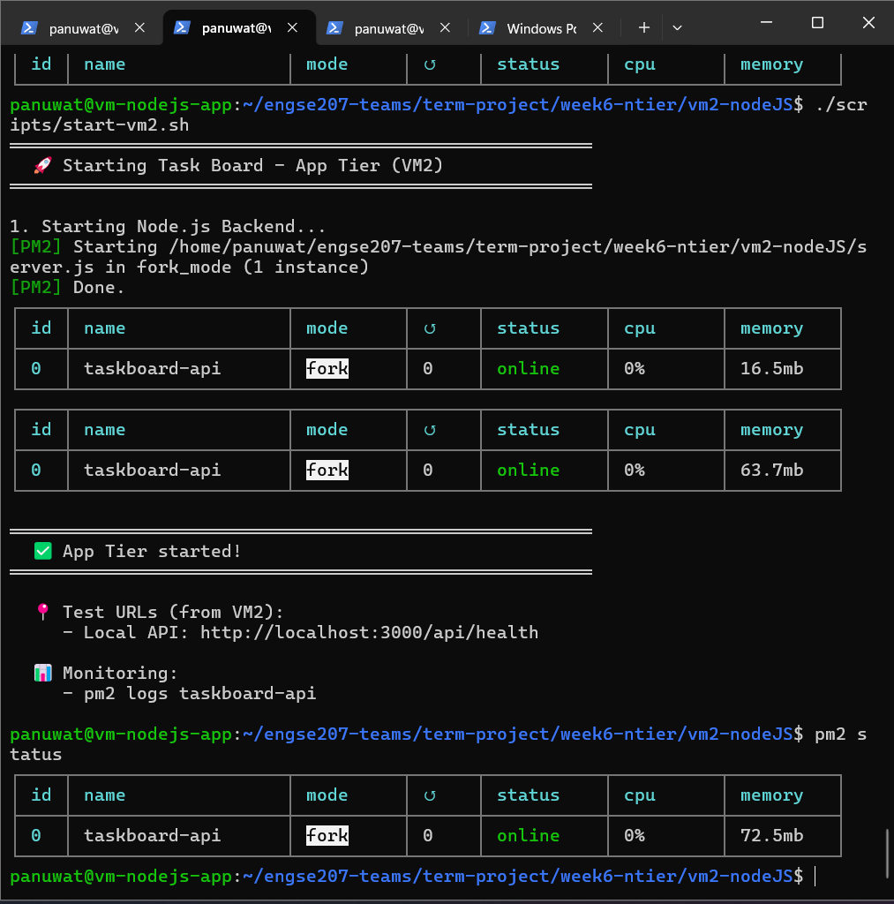

# 📋 Task Board - N-Tier Architecture (Week 6)

โปรเจกต์นี้เป็นแอปพลิเคชัน ที่ออกแบบมาเพื่อแสดงให้เห็นถึง **สถาปัตยกรรมแบบ N-Tier** แบบคลาสสิก ระบบประกอบด้วยสามชั้นที่แตกต่างกัน โดยแต่ละชั้นทำงานบนเครื่องเสมือนที่แยกจากกัน ซึ่งจัดเตรียมโดย Vagrant

- **Tier 1: เว็บเซิร์ฟเวอร์ (Nginx)**
- **Tier 2: แอปพลิเคชันเซิร์ฟเวอร์ (Node.js)**
- **Tier 3: ฐานข้อมูล (PostgreSQL)**


---

## 🏗️ สถาปัตยกรรม

แอปพลิเคชันนี้ใช้รูปแบบสถาปัตยกรรมแบบ 3-Tier สำหรับคำอธิบายโดยละเอียดเกี่ยวกับส่วนประกอบและการสื่อสาร โปรดดูที่ [**เอกสารสถาปัตยกรรม**](docs/ARCHITECTURE.md)



---

## 🚀 เริ่มต้นใช้งาน

### ข้อกำหนดเบื้องต้น

- [VirtualBox](https://www.virtualbox.org/)
- [Vagrant](https://www.vagrantup.com/)

### การติดตั้งและการรัน

1.  **โคลน repository:**
    ```sh
    git clone git@github.com:Panuwat-ta/engse207-teams.git
    cd term-project/week6-ntier
    ```

2.  **เริ่มเครื่องเสมือน:**
    ใช้คำสั่ง `vagrant up` เพื่อสร้างและจัดเตรียม VM ทั้งสามเครื่อง

    ```sh
    vagrant up
    ``` 

    สิ่งนี้จะเริ่มเครื่องตามลำดับต่อไปนี้<br>

    `vm1` (Nginx)
    

    `vm2` (Node.js)
    

    `vm3` (ฐานข้อมูล)
    

---

## 🧪 การทดสอบ

คุณสามารถทดสอบแต่ละส่วนประกอบของระบบเพื่อให้แน่ใจว่าทำงานได้อย่างถูกต้อง

### 1. ทดสอบเว็บเซิร์ฟเวอร์ (VM1 - Nginx)

- **SSH เข้าสู่ vm1:**
  ```sh
  ssh panuwat@192.168.56.111
  ```
- **รันสคริปต์ทดสอบ:**
  สคริปต์จะ ping แอปพลิเคชันเซิร์ฟเวอร์ (vm2) เพื่อให้แน่ใจว่ามีการเชื่อมต่อ
  ```sh
  ./scripts/test-api-nginx.sh
  ```
  

### 2. ทดสอบแอปพลิเคชันเซิร์ฟเวอร์ (VM2 - Node.js)

- **SSH เข้าสู่ vm2:**
  ```sh
  ssh panuwat@192.168.56.112
  ```
- **รันสคริปต์ทดสอบ:**
  สคริปต์จะสอบถามฐานข้อมูลเพื่อให้แน่ใจว่าสามารถดึงข้อมูลได้
  ```sh
  ./scripts/test-api.sh
  ```
  

### 3. ทดสอบฐานข้อมูลเซิร์ฟเวอร์ (VM3 - PostgreSQL)

- **SSH เข้าสู่ vm3:**
  ```sh
  ssh panuwat@192.168.56.114
  ```
- **รันสคริปต์ทดสอบ:**
  สคริปต์จะเชื่อมต่อกับฐานข้อมูล PostgreSQL และแสดงตาราง
  ```sh
  ./scripts/test-database.sh
  ```
  

## 🔌 Ports & Communication

- **VM1 (Nginx):**
  - รับคำขอจากผู้ใช้ผ่านพอร์ต **80 (HTTP)/ 443 (HTTPS)**

- **VM2 (Node.js / Express):**
  - รับคำขอจาก Nginx ผ่านพอร์ต **3000**

- **VM3 (PostgreSQL):**
  - รับคำขอจาก Application Server ผ่านพอร์ต **5432**


## 🔄 Request Flow

1. ผู้ใช้ส่งคำขอผ่านเว็บเบราว์เซอร์ไปยัง Nginx (VM1)
2. Nginx ทำหน้าที่เป็น Reverse Proxy ส่งคำขอไปยัง Node.js API (VM2)
3. Node.js ติดต่อฐานข้อมูล PostgreSQL (VM3) เพื่อจัดการข้อมูลงาน และส่งผลลัพธ์กลับไปยังผู้ใช้
