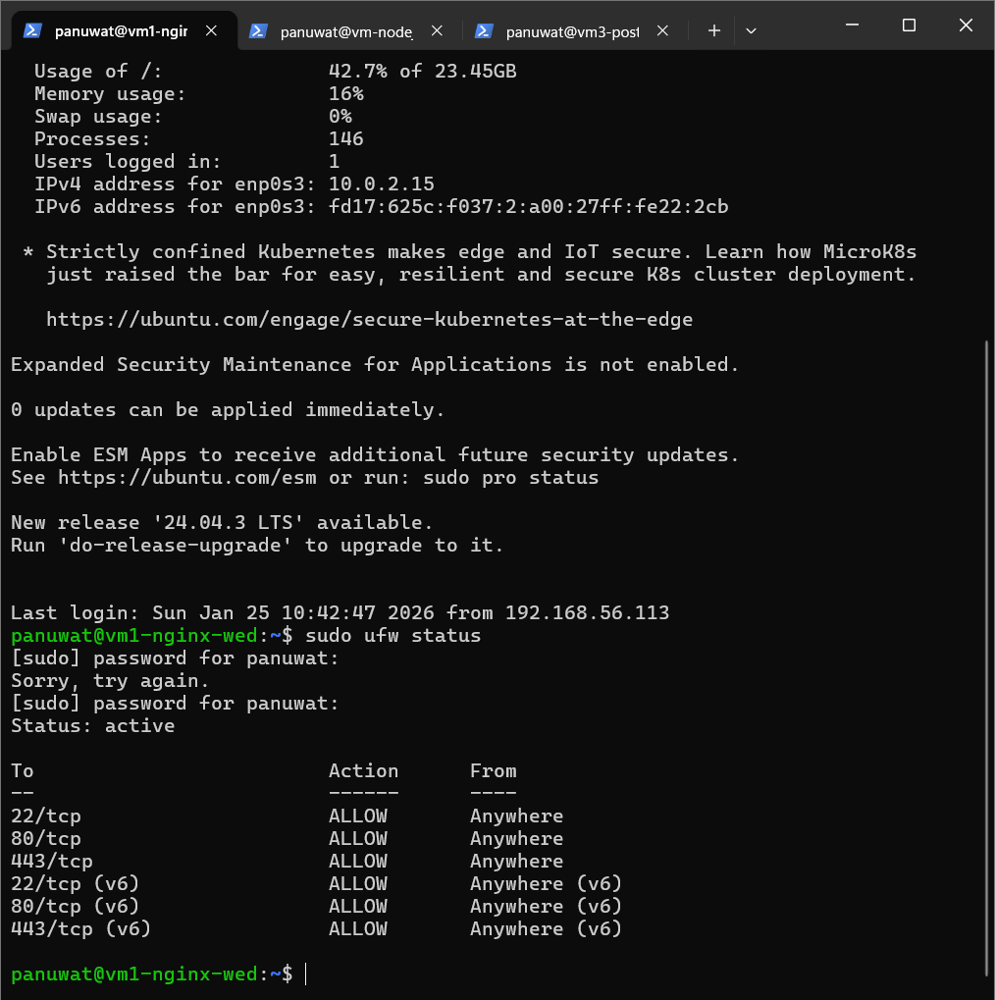
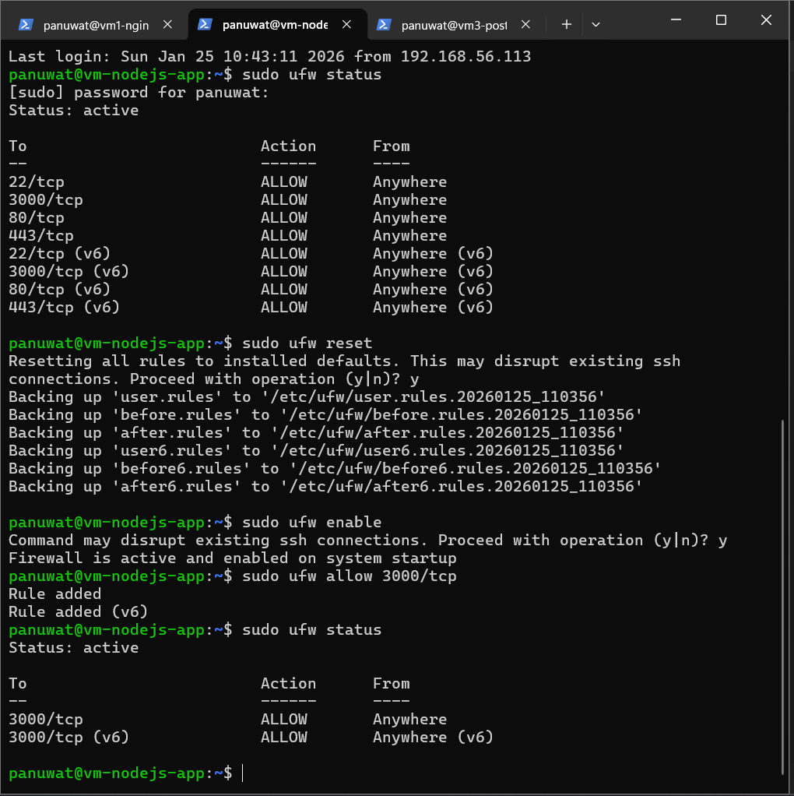
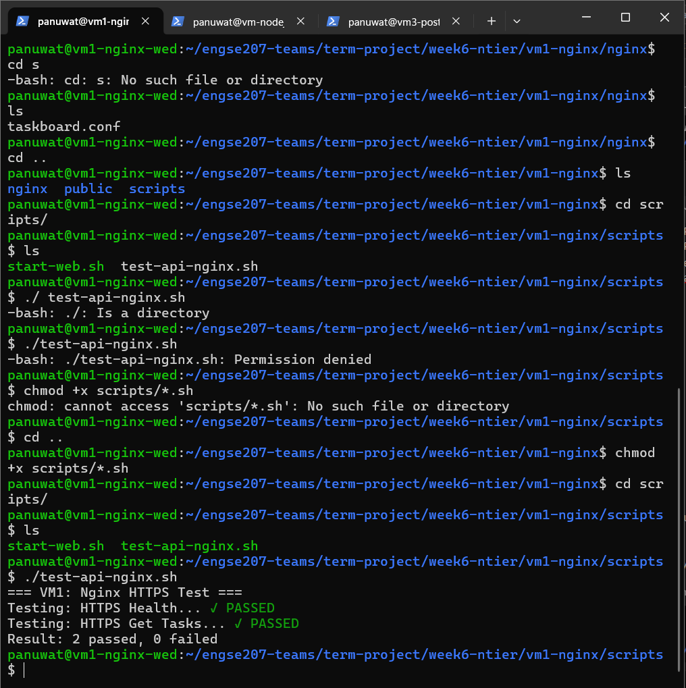

# 📊 ANALYSIS.md - Week 6 N-Tier Architecture Analysis
## การวิเคราะห์และเปรียบเทียบ 4 Architectures (Week 3-6)

**ชื่อ-นามสกุล:** ภานุวัฒน์ ต๋าคำ  
**รหัสนักศึกษา:** 67543210044-3  
**วันที่ส่ง:** January 28, 2026

---

## คำถาม 1: เปรียบเทียบ 4 Architectures (15 คะแนน)

### ตารางเปรียบเทียบ

| ด้าน | Week 3 (Monolithic) | Week 4 (Layered) | Week 5 (Client-Server) | Week 6 (N-Tier) |
|------|---------------------|------------------|------------------------|-----------------|
| **Database** | SQLite | SQLite | SQLite | PostgreSQL |
| **Web Server** | Node.js/Express | Node.js/Express | Node.js/Express (API) | Nginx (Reverse Proxy) |
| **Protocol** | HTTP | HTTP | HTTP/REST | HTTPS/REST |
| **Separation Type** | No Separation (Single Process) | Logical Separation | Physical Separation (2 Tiers) | Physical Separation (3+ Tiers) |
| **Number of Processes** | 1 | 1 | 2 (Client, Server) | 3+ (Client, Web, App, DB) |
| **Network Required** | No (for local access) | No (for local access) | Yes | Yes |
| **Scalability** | Low | Low | Medium | High |
| **Security Level** | Low | Low | Medium | High |
| **Complexity** | Low | Low-Medium | Medium | High |
| **Deploy Difficulty**| Easy | Easy | Medium | Hard |
| **Development Speed**| Fast | Fast | Medium | Slow (initially) |
| **Production Ready** | No | No | Yes (for small scale) | Yes (for large scale) |

### อธิบายเพิ่มเติม:

**Week 3 (Monolithic):**
```
- ข้อดีหลัก: ง่ายต่อการพัฒนาและ Deploy ในช่วงเริ่มต้น เพราะทุกอย่างรวมอยู่ในโปรเจกต์เดียว
- ข้อเสียหลัก: ขยายระบบ (Scale) ได้ยาก, การแก้ไขส่วนหนึ่งอาจกระทบส่วนอื่น (High Coupling), เทคโนโลยีถูกผูกมัด
- เหมาะกับ: โปรเจกต์ขนาดเล็ก, ต้นแบบ (MVP), หรือระบบที่ไม่ต้องการการขยายตัวมาก
```

**Week 4 (Layered):**
```
- ข้อดีหลัก: แบ่งโค้ดเป็นสัดส่วน (Logical Separation) ทำให้ดูแลรักษาง่ายขึ้น, ทดสอบแต่ละส่วนได้ง่ายขึ้น
- ข้อเสียหลัก: ยังคงเป็น Process เดียวกัน ทำให้มีปัญหา уз목 (Bottleneck) และ Scalability เหมือน Monolithic
- เหมาะกับ: โปรเจกต์ที่ต้องการโครงสร้างชัดเจนแต่ยังไม่ต้องการแยก Process, ระบบงานภายในองค์กร
```

**Week 5 (Client-Server):**
```
- ข้อดีหลัก: แยกส่วน Client และ Server ชัดเจน ทำให้พัฒนาแต่ละส่วนได้อิสระ, สามารถมี Client ได้หลายรูปแบบ (Web, Mobile)
- ข้อเสียหลัก: มีความซับซ้อนในการสื่อสารผ่าน Network, ต้องจัดการเรื่อง State และ Security ระหว่าง Client-Server
- เหมาะกับ: แอปพลิเคชันส่วนใหญ่ในปัจจุบัน เช่น Web App, Mobile App ที่มี Backend API
```

**Week 6 (N-Tier):**
```
- ข้อดีหลัก: Scalability สูงมาก สามารถขยายแต่ละ Tier ได้อย่างอิสระ, Security สูงเพราะมีหลายชั้นป้องกัน
- ข้อเสียหลัก: ซับซ้อนในการติดตั้งและดูแลรักษาสูง, มี Latency จากการสื่อสารข้าม Network ระหว่าง Tier
- เหมาะกับ: ระบบขนาดใหญ่ที่ต้องการความเสถียร, ความปลอดภัย และรองรับผู้ใช้จำนวนมาก เช่น E-commerce, Banking
```

---

## คำถาม 2: Quality Attributes Radar Chart (10 คะแนน)

### ตารางคะแนน (1-5 คะแนน)

| Quality Attribute | Week 3 | Week 4 | Week 5 | Week 6 | หมายเหตุ |
|-------------------|--------|--------|--------|--------|----------|
| **Performance** | 5 | 4 | 3 | 3 | Week 3 เร็วสุดเพราะไม่มี Network Latency |
| **Scalability** | 1 | 1 | 3 | 5 | Week 6 สามารถ Scale แต่ละ Tier แยกกันได้ |
| **Security** | 1 | 2 | 3 | 5 | Week 6 มีหลายชั้นในการป้องกันข้อมูล |
| **Maintainability** | 2 | 4 | 4 | 3 | Week 4 ดูแลง่ายเพราะโครงสร้างชัดเจนในโค้ดเบสเดียว |
| **Testability** | 2 | 3 | 4 | 4 | Week 5-6 ทดสอบ API แยกจาก UI ได้ |
| **Deployability** | 5 | 5 | 3 | 1 | Week 6 ซับซ้อนสุดในการ Deploy |
| **Availability** | 2 | 2 | 3 | 5 | Week 6 สามารถทำ Redundancy ในแต่ละ Tier |
| **Modifiability** | 2 | 3 | 4 | 4 | Week 5-6 แก้ไขส่วน UI/API ได้อิสระ |
| **รวม** | 20/40 | 24/40 | 27/40 | 30/40 | คะแนนรวมสะท้อนความพร้อมสำหรับ Production |

### คำอธิบายการให้คะแนน:

**Performance (ความเร็ว):**
```
- Week 3: 5 คะแนน เพราะ ทุกอย่างทำงานใน process เดียว ไม่มีความล่าช้าจาก network (latency)
- Week 4: 4 คะแนน เพราะ แม้จะแบ่ง Layer แต่ยังอยู่ใน process เดียว performance จึงลดลงเล็กน้อยจากการเรียกข้าม Layer
- Week 5: 3 คะแนน เพราะ มี network latency ระหว่าง Client กับ Server
- Week 6: 3 คะแนน เพราะ มี network latency เพิ่มขึ้นระหว่างแต่ละ Tier (Web, App, DB)
```

**Scalability (รองรับการขยาย):**
```
- Week 3: 1 คะแนน เพราะ Scale ได้ทางเดียวคือ Vertical (เพิ่มสเปคเครื่อง)
- Week 4: 1 คะแนน เพราะ เหมือน Week 3 คือ Scale ได้แค่ Vertical
- Week 5: 3 คะแนน เพราะ สามารถ Scale ส่วนของ Server แยกจาก Client ได้ (Horizontal Scaling)
- Week 6: 5 คะแนน เพราะ Scale แต่ละ Tier (Web, App, DB) ได้อย่างอิสระ ทำให้รองรับภาระงานได้ดีที่สุด
```

**Security (ความปลอดภัย):**
```
- Week 3: 1 คะแนน เพราะ Database เข้าถึงได้โดยตรงจากโค้ด ไม่มีชั้นป้องกัน
- Week 4: 2 คะแนน เพราะ มี Layer พอช่วยแยกส่วน แต่ยังอยู่ใน process เดียวกัน
- Week 5: 3 คะแนน เพราะ มีการแบ่งแยก Client-Server แต่ยังต้องจัดการ Security ที่ API endpoint
- Week 6: 5 คะแนน เพราะ มีหลายชั้น (Defense in Depth) เช่น Firewall, Reverse Proxy, VPC ทำให้เข้าถึง DB โดยตรงจากภายนอกไม่ได้
```

**Maintainability (ความสะดวกในการดูแล):**
```
- Week 3: 2 คะแนน เพราะ โค้ดพันกัน (Spaghetti code) แก้ไขยาก
- Week 4: 4 คะแนน เพราะ โครงสร้าง Layered ทำให้โค้ดเป็นระเบียบ เข้าใจและแก้ไขง่ายที่สุดในโค้ดเบสเดียว
- Week 5: 4 คะแนน เพราะ แยก Client/Server ชัดเจน ทำให้ทีม frontend/backend ทำงานคู่กันได้ดี
- Week 6: 3 คะแนน เพราะ ความซับซ้อนของหลาย Tier ทำให้การไล่โค้ดและแก้ปัญหายากขึ้น
```

**Testability (ความสะดวกในการทดสอบ):**
```
- Week 3: 2 คะแนน เพราะ ต้องทดสอบทั้งระบบพร้อมกัน (End-to-End) แยกส่วนทดสอบยาก
- Week 4: 3 คะแนน เพราะ สามารถเขียน Unit Test ในแต่ละ Layer ได้ง่ายขึ้น
- Week 5: 4 คะแนน เพราะ สามารถทดสอบ API (Backend) และ UI (Frontend) แยกจากกันได้อย่างสมบูรณ์
- Week 6: 4 คะแนน เพราะ เหมือน Week 5 แต่การทำ Integration Test จะซับซ้อนขึ้น
```

**Deployability (ความสะดวกในการ Deploy):**
```
- Week 3: 5 คะแนน เพราะ แค่ copy โฟลเดอร์ไปวางแล้วรันก็ได้เลย
- Week 4: 5 คะแนน เพราะ เหมือน Week 3
- Week 5: 3 คะแนน เพราะ ต้อง Deploy 2 ส่วน (Client, Server) และตั้งค่า Network
- Week 6: 1 คะแนน เพราะ ต้อง Deploy และตั้งค่าหลายระบบ (Reverse Proxy, App Server, DB) ซึ่งซับซ้อนและใช้เวลามาก
```

---

## คำถาม 3: สถานการณ์การใช้งาน (10 คะแนน)

### สถานการณ์ A: Startup MVP

**Context:**
- งบประมาณ: 50,000 บาท
- ทีม: 2 คน (Junior developers)
- Timeline: 1 เดือน
- Users: 100 คน
- ความต้องการพิเศษ: ต้องการ feedback จากลูกค้าเร็ว

**Architecture ที่เลือก:** [x] Week 3 / [ ] Week 4 / [ ] Week 5 / [ ] Week 6

**เหตุผล:**
```
Monolithic เป็นตัวเลือกที่ดีที่สุดสำหรับสถานการณ์นี้ เพราะทีมมีขนาดเล็ก ประสบการณ์น้อย และมีเวลาจำกัด
สถาปัตยกรรมแบบนี้ง่ายต่อการพัฒนาและติดตั้ง ทำให้สามารถสร้าง MVP (Minimum Viable Product)
เพื่อเก็บ Feedback จากผู้ใช้ได้อย่างรวดเร็วที่สุด ซึ่งเป็นเป้าหมายสำคัญของ Startup ในระยะแรก
```

---

### สถานการณ์ B: E-commerce Platform

**Context:**
- งบประมาณ: 2,000,000 บาท
- ทีม: 10 คน (Mixed experience)
- Timeline: 6 เดือน
- Users: 100,000 คน
- ความต้องการพิเศษ: รองรับ Flash Sale, Payment Gateway

**Architecture ที่เลือก:** [ ] Week 3 / [ ] Week 4 / [ ] Week 5 / [x] Week 6

**เหตุผล:**
```
N-Tier เหมาะสมที่สุดสำหรับ E-commerce ขนาดใหญ่ เพราะ:
1.  **Scalability:** สามารถขยาย App Server หรือ DB Server เพื่อรองรับช่วง Flash Sale ที่มี traffic สูงๆ ได้
2.  **Security:** การแยก Tier ช่วยปกป้องข้อมูลสำคัญของลูกค้าและข้อมูลการจ่ายเงิน (Payment Gateway)
3.  **Availability:** สามารถออกแบบให้มี Redundancy ในแต่ละ Tier เพื่อให้ระบบไม่ล่มง่าย
```

---

### สถานการณ์ C: Internal Company Tool

**Context:**
- งบประมาณ: 200,000 บาท
- ทีม: 3 คน (Mid-level)
- Timeline: 2 เดือน
- Users: 50 คน (พนักงานบริษัท)
- ความต้องการพิเศษ: ใช้งานภายในองค์กร, VPN

**Architecture ที่เลือก:** [ ] Week 3 / [x] Week 4 / [ ] Week 5 / [ ] Week 6

**เหตุผล:**
```
Layered Architecture (Week 4) มีความเหมาะสม เพราะ:
1.  **Maintainability:** โค้ดมีโครงสร้างชัดเจน ดูแลรักษาง่ายสำหรับทีมขนาดเล็ก
2.  **Simplicity:** ไม่ซับซ้อนเท่า Client-Server หรือ N-Tier ทำให้พัฒนาได้เร็วใน 2 เดือน
3.  **Security:** เนื่องจากเป็นระบบภายในและเข้าผ่าน VPN ความเสี่ยงด้านความปลอดภัยจึงต่ำกว่าระบบที่เปิด Public
ทำให้ไม่จำเป็นต้องใช้ N-Tier ที่ซับซ้อน
```

---

### สถานการณ์ D: Banking Application

**Context:**
- งบประมาณ: 10,000,000 บาท
- ทีม: 20 คน (Senior + Mid)
- Timeline: 12 เดือน
- Users: 1,000,000 คน
- ความต้องการพิเศษ: Security Critical, Compliance, Audit logs

**Architecture ที่เลือก:** [ ] Week 3 / [ ] Week 4 / [ ] Week 5 / [x] Week 6

**เหตุผล:**
```
N-Tier เป็นสถาปัตยกรรมเดียวที่เหมาะสมกับแอปพลิเคชันธนาคาร ด้วยเหตุผลด้าน:
1.  **Security:** เป็นหัวใจสำคัญที่สุด การมีหลาย Tier ช่วยให้สามารถวางมาตรการความปลอดภัยได้หลายชั้น (Defense in Depth)
    เช่น การแยก Network, Firewall, การเข้ารหัสข้อมูลระหว่าง Tier ซึ่งจำเป็นสำหรับ Compliance
2.  **Scalability & Availability:** ต้องรองรับผู้ใช้จำนวนมากและต้องพร้อมใช้งานตลอดเวลา
3.  **Auditability:** การแยก Tier ทำให้การเก็บ Audit logs ในแต่ละส่วนทำได้ง่ายและปลอดภัย
```

---

## คำถาม 4: ประสบการณ์จากการทำ Lab (5 คะแนน)

### ก. ปัญหาที่พบในการทำ Week 6:

| # | ปัญหา | สาเหตุ | วิธีแก้ไข |
|---|-------|--------|----------|
| 1 | Nginx 502 Bad Gateway | App Server (Node.js) ไม่ได้ทำงาน หรือ Nginx ชี้ไปที่ port ของ App Server ผิด | ตรวจสอบสถานะของ App Server ด้วย `pm2 status` และตรวจสอบไฟล์ `nginx.conf` ตรง `proxy_pass` ให้ถูกต้อง |
| 2 | เชื่อมต่อ PostgreSQL ไม่ได้ | ค่า `DATABASE_URL` ในไฟล์ `.env` ไม่ถูกต้อง หรือ Firewall ของ VM ปิดกั้น port 5432 | ตรวจสอบค่า `DATABASE_URL` (user, password, host, port, db name) และใช้ `ufw allow 5432` เพื่อเปิด port |
| 3 | หน้าเว็บขึ้น HTTPS ไม่ปลอดภัย | Browser ไม่เชื่อถือ Self-signed certificate ที่สร้างขึ้นเอง | ต้องกด "Proceed to unsafe" ใน browser หรือติดตั้ง Certificate ที่สร้างขึ้นเป็น Trusted Authority ในเครื่อง (สำหรับทดสอบ) |

### ข. เวลาที่ใช้ในแต่ละส่วน:

| ส่วนงาน | เวลาที่คาด | เวลาจริง | หมายเหตุ |
|---------|-----------|---------|----------|
| ติดตั้ง PostgreSQL | 1 ชม. | 2 ชม. | ใช้เวลาในการตั้งค่า user และ permission |
| ติดตั้ง Nginx | 30 นาที | 1 ชม. | ใช้เวลาเรียนรู้ config file |
| สร้าง SSL Certificate | 30 นาที | 1 ชม. | ไม่เคยทำมาก่อน เลยต้องดู tutorial เพิ่ม |
| Migrate Database | 30 นาที | 30 นาที | ไม่มีปัญหา |
| ตั้งค่า Nginx Config | 1 ชม. | 3 ชม. | ยากที่สุดในการ debug เรื่อง proxy และ SSL |
| Testing | 1 ชม. | 2 ชม. | ทดสอบหลายส่วน ทั้ง API, DB, UI |
| **รวม** | 4.5 ชม. | 9.5 ชม. | ใช้เวลามากกว่าที่คาดไว้มาก |

### ค. สิ่งที่ได้เรียนรู้ใหม่:

```
1. การทำงานของ Reverse Proxy และประโยชน์ของมันในการทำ Load Balancing และซ่อน App Server
2. ขั้นตอนการสร้างและติดตั้ง SSL/TLS Certificate เพื่อทำ HTTPS
3. การตั้งค่า Nginx ให้ทำงานกับ Node.js Express Application
4. ความแตกต่างระหว่าง Physical Tiers และ Logical Layers
5. การจัดการหลายๆ VM และการเชื่อมต่อกันผ่าน Private Network ใน Vagrant
```

---

## คำถาม 5: Evolution Path (5 คะแนน)

### เมื่อไหร่ควร Evolve จาก Architecture หนึ่งไปอีกแบบ?

**จาก Monolithic → Layered:**
```
Trigger/เงื่อนไข:
1. เมื่อโค้ดเริ่มใหญ่และซับซ้อนจนแก้ไขได้ยาก (spaghetti code)
2. เมื่อต้องการเพิ่ม Unit Test เพื่อให้มั่นใจในคุณภาพของโค้ด
3. เมื่อมีทีมพัฒนามากกว่า 1 คน และต้องการแบ่งงานกันทำตามหน้าที่ของโค้ด (เช่น UI, Business Logic, Data)
```

**จาก Layered → Client-Server:**
```
Trigger/เงื่อนไข:
1. เมื่อต้องการสร้าง Client เพิ่มเติม นอกจาก Web-based เช่น Mobile Application
2. เมื่อต้องการแยกทีมพัฒนา Frontend และ Backend ออกจากกันอย่างชัดเจน
3. เมื่อต้องการ Scale Frontend และ Backend แยกจากกัน
```

**จาก Client-Server → N-Tier:**
```
Trigger/เงื่อนไข:
1. เมื่อ Backend เริ่มรับภาระงานหนัก และต้องการแยกส่วนของ Business Logic (App) ออกจากส่วนของข้อมูล (DB) เพื่อ Scale
2. เมื่อต้องการความปลอดภัยระดับสูง โดยการไม่ให้ App Server ต่อกับ Database ที่อยู่ใน Public Subnet
3. เมื่อระบบมีความซับซ้อนสูง และต้องการแยกส่วนประกอบต่างๆ เพื่อให้ดูแลรักษาง่ายขึ้น เช่น แยก Web Server, App Server, Cache Server
```

**จาก N-Tier → Microservices:**
```
Trigger/เงื่อนไข:
1. เมื่อ App Server (Monolithic Backend) ใหญ่เกินไป และการแก้ไข/deploy ทำได้ช้าและเสี่ยง
2. เมื่อแต่ละส่วนของธุรกิจ (เช่น Orders, Users, Payments) ต้องการ Scale ไม่เท่ากัน และใช้เทคโนโลยีต่างกัน
3. เมื่อต้องการให้ทีมพัฒนาขนาดเล็กหลายๆ ทีม รับผิดชอบ Service ของตัวเองได้อย่างเป็นอิสระ (Decentralized Governance)
```

### Decision Flowchart:

```
                              เริ่มโปรเจกต์ใหม่
                                    │
                                    ▼
                    ┌───────────────────────────────┐
                    │  ทีมมีประสบการณ์น้อย?            │
                    │  งบประมาณจำกัด?               │
                    │  Timeline สั้น? (ทำ MVP)       │
                    └───────────────┬───────────────┘
                                    │
                        ┌───────────┴───────────┐
                        │ Yes                   │ No
                        ▼                       ▼
                   [Monolithic]     ┌───────────────────────────┐
                        │           │ ต้องการ Frontend/Backend   │
            ┌───────────┴───────────┤ แยกกัน หรือมี Mobile App?   │
            │ โค้ดใหญ่ขึ้น?           └───────────┬───────────────┘
            │ ต้องการ Testability?   │           │
            └───────────┬───────────┘           │
                        │           ┌───────────┴───────────┐
            ┌───────────┴───────────┐ │ Yes                   │ No
            │ Yes                   │ ▼                       ▼
            ▼                       │ [Client-Server]     [Layered]
       [Layered]                    │ (Focus on API)      (Internal Tool)
            │                       │
    ┌───────┴───────────────┐ ┌─────┴─────────────────┐
    │ ต้องการ Security สูง?    │ │ ต้องการ Scale DB/App  │
    │ ต้องการ Scale แยกส่วน?  │ │ แยกกัน?               │
    └───────────┬───────────┘ └───────────┬───────────┘
                │                         │
    ┌───────────┴───────────┐ ┌───────────┴───────────┐
    │ Yes                   │ │ Yes                   │
    ▼                       ▼ ▼                       ▼
[N-Tier]                  (Stay) [N-Tier]                 (Stay)
    │
┌───┴───────────────────┐
│ App ใหญ่เป็นก้อน?       │
│ ต้องการ Deploy อิสระ?   │
└──────────┬────────────┘
           │ Yes
           ▼
     [Microservices]
```

---

## คำถาม 6: บทเรียนสำคัญ (5 คะแนน)

### Top 3 บทเรียนจากการทำ Lab Week 3-6:

**บทเรียนที่ 1:**
```
หัวข้อ: "No Silver Bullet" in Software Architecture
รายละเอียด: ไม่มีสถาปัตยกรรมไหนดีที่สุดสำหรับทุกสถานการณ์ การเลือกใช้ Monolithic สำหรับโปรเจกต์เล็กๆ
ในช่วงแรกอาจจะดีกว่า N-Tier ที่ซับซ้อน การเลือกสถาปัตยกรรมคือการ Trade-off ระหว่าง Quality Attributes ต่างๆ
จะนำไปใช้อย่างไร: ก่อนเริ่มโปรเจกต์ใหม่ จะทำการวิเคราะห์ความต้องการทางธุรกิจ (Business Requirements) และ
Non-Functional Requirements (เช่น Scalability, Security) เพื่อเลือกสถาปัตยกรรมที่เหมาะสมที่สุด ณ เวลานั้น
```

**บทเรียนที่ 2:**
```
หัวข้อ: The Importance of DevOps and Automation
รายละเอียด: ยิ่งสถาปัตยกรรมซับซ้อนขึ้น (จาก Monolith ไป N-Tier) ความยากลำบากในการติดตั้งและ Deploy
จะเพิ่มขึ้นแบบทวีคูณ การมี Script อัตโนมัติ (เช่น Vagrant, Shell script) ช่วยลดความผิดพลาดและประหยัดเวลาได้มหาศาล
จะนำไปใช้อย่างไร: จะศึกษาและฝึกฝนเครื่องมือ DevOps เช่น Docker, Ansible, CI/CD pipelines เพื่อนำไปใช้
ในการทำงานจริง ทำให้การ Deploy ระบบที่ซับซ้อนเป็นเรื่องง่ายและน่าเชื่อถือ
```

**บทเรียนที่ 3:**
```
หัวข้อ: Network and Security are Not Afterthoughts
รายละเอียด: ใน Week 5 และ 6 ปัญหาหลายอย่างเกิดจากการตั้งค่า Network, Firewall และ SSL Certificate
การออกแบบสถาปัตยกรรมต้องคำนึงถึงเรื่องเหล่านี้ตั้งแต่แรก ไม่ใช่ทำฟีเจอร์เสร็จแล้วค่อยมาคิด
จะนำไปใช้อย่างไร: ในการออกแบบระบบครั้งต่อไป จะวางแผนเรื่อง Network Diagram, IP Address,
Ports ที่ต้องเปิด และแผนการทำ Security (เช่น HTTPS) ไปพร้อมๆ กับการออกแบบ Application
```

### ถ้าเริ่มทำใหม่ตั้งแต่ Week 3 จะทำอะไรต่างไป?

```
1. ใช้ Git ตั้งแต่แรกและ Commit ให้บ่อยขึ้น: ในช่วงแรกทำโปรเจกต์บนเครื่องแล้วค่อย push ทำให้ history ไม่ละเอียด
2. เขียน Shell Script สำหรับ automate งานที่ทำซ้ำๆ: เช่น script ติดตั้ง dependencies หรือ script ทดสอบ API
3. วางแผนเรื่อง Environment Variable (.env) ให้ดี: บางครั้ง hardcode ค่าต่างๆ ไว้ ทำให้ย้ายไป deploy ที่อื่นลำบาก
```

### ทักษะที่ได้พัฒนามากที่สุด:

| ทักษะ | ระดับก่อนทำ (1-5) | ระดับหลังทำ (1-5) | หมายเหตุ |
|-------|------------------|------------------|----------|
| Linux/Ubuntu | 2 | 4 | ได้ใช้ command line เยอะมาก |
| Database (SQL) | 3 | 4 | ได้ลองใช้ PostgreSQL และ Migrate ข้อมูล |
| Web Server (Nginx) | 1 | 4 | สามารถ config reverse proxy และ SSL ได้ |
| Node.js/Express | 3 | 4 | เข้าใจการทำ REST API มากขึ้น |
| REST API | 3 | 4 | ออกแบบและทดสอบ API ได้คล่องขึ้น |
| Git/Version Control | 3 | 4 | เข้าใจ workflow การทำงานกับ branch |
| Networking | 1 | 3 | เข้าใจเรื่อง IP, Port, Firewall, HTTPS มากขึ้น |
| Security (SSL/HTTPS) | 1 | 3 | ได้ลงมือทำจริง จากที่ไม่เคยทำเลย |
| Architecture Thinking | 2 | 4 | เห็นภาพรวมและข้อดีข้อเสียของแต่ละแบบชัดเจน |

### สิ่งที่ยังสับสนหรืออยากเรียนรู้เพิ่ม:

```
1. Load Balancing: อยากลองทำ Load Balancing จริงๆ กับ Nginx ว่าจะกระจาย traffic ไปยัง App Server หลายๆ ตัวได้อย่างไร
2. Microservices: อยากเรียนรู้การทำ Service Discovery, API Gateway และการสื่อสารระหว่าง Service
3. Containerization (Docker/Kubernetes): อยากลองนำ N-Tier architecture ที่ทำไปใส่ใน Docker และ Deploy ด้วย Kubernetes
```

---

## 📸 Screenshots

### Screenshot 1: Services Status




### Screenshot 2: HTTPS in Browser


### Screenshot 3: API Response



---

## 🔗 Links

- **GitHub Repository:** https://github.com/Panuwat-ta/engse207-teams
- **VM IP Address:** 192.168.56.111 (VM1), 192.168.56.112 (VM2), 192.168.56.114 (VM3)
- **API Endpoint:** https://taskboard.local/api

---

## ✅ Self-Check Before Submit

- [x] ตารางเปรียบเทียบกรอกครบทุกช่อง
- [x] Quality Attributes ให้คะแนนและอธิบายครบ
- [x] สถานการณ์ 4 ข้อ ตอบครบทุกข้อ
- [x] ปัญหาและวิธีแก้ไขระบุชัดเจน
- [x] Evolution Path วาดครบ
- [x] บทเรียนสำคัญ 3 ข้อ
- [x] Push ไป GitHub แล้ว

---